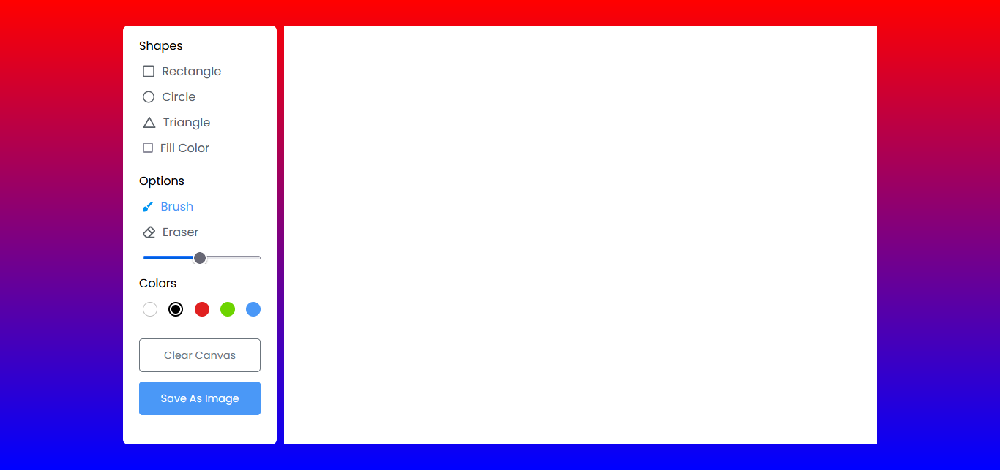
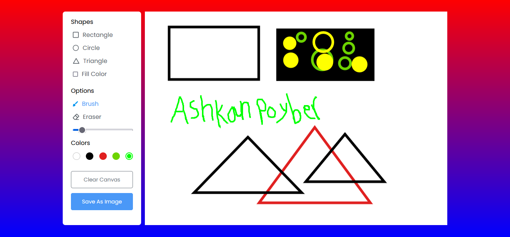
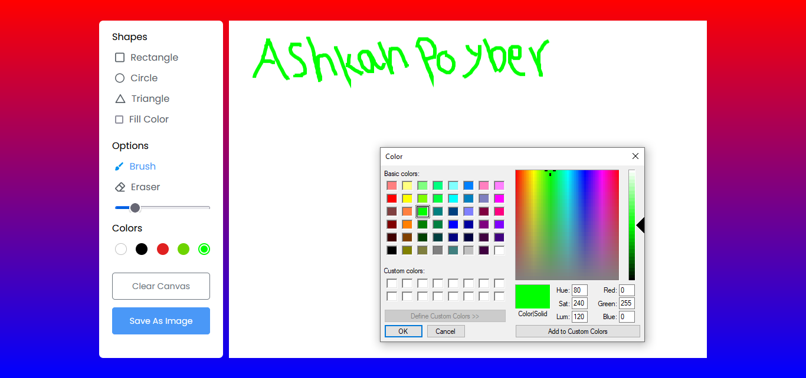

<h1 align="center">
      
    𝑷𝒂𝒊𝒏𝒕 𝑨𝒑𝒑
      
</h1>

#  Paint App
🛑 In This Program , You Can Design Your Drawings Like A Simple And Basic Drawing And Painting Program , And Save Them At The End , And In This Program , Users Can Draw Various Shapes In Various Dimensions Like Rectangles , Circles , Square And Another Shapes That You Want To Create And Desing , And Then You Can Add Various Texts With , You Can Implement Various Features , Then You Can Save Your Design And After That You Can Clear Canvas That Continue To Start To New Design :) , To Get More Information About This Program , You Can Use This Project And Enjoy It . If You're Looking For My Other Projects Then [Click Here!](https://github.com/AshkanPoyber?tab=repositories)

#  Changelog
v1.0.0.0 :  
✅ Final Version Published!
#  ToDo List
💢 Create Icon
 
💢 Download Some Images For Shapes And Options Section
 
💢 Coding And Enjoy It :)
 
💢 And Absolutely So Much More !
 
#  Known Issue's
⚠ It Is Final Version , Then Its Not Getting So Problems. But If You Encounter Any Problem , Let Me Know By Sending An Email 

#  ScreenShots

💢And Also You Can Choose Another Color💢 

  

